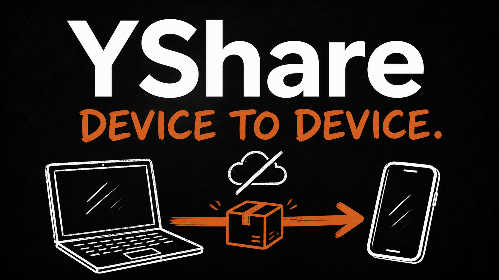
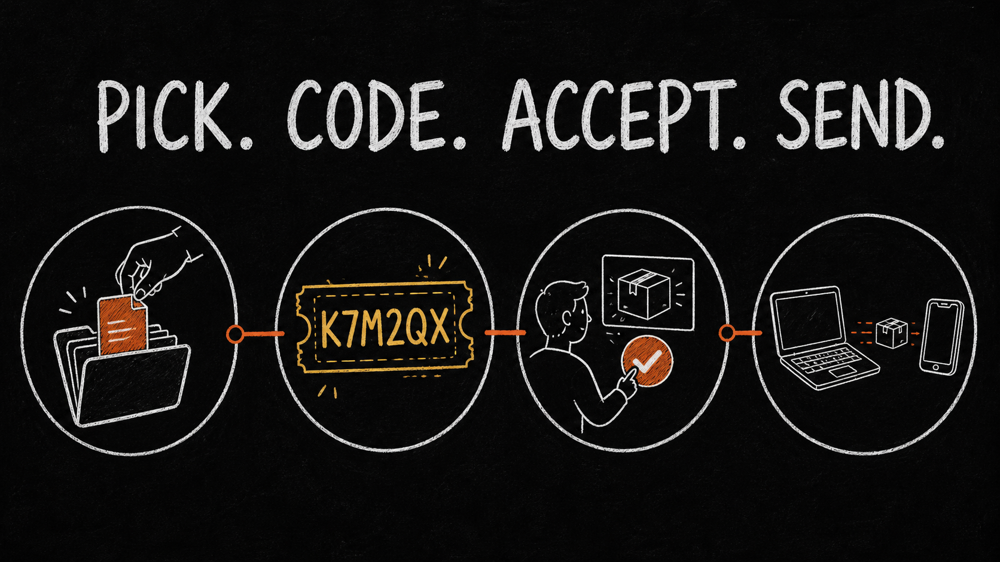
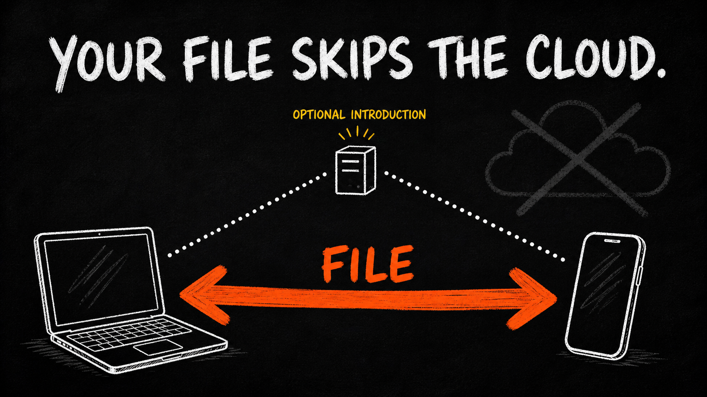
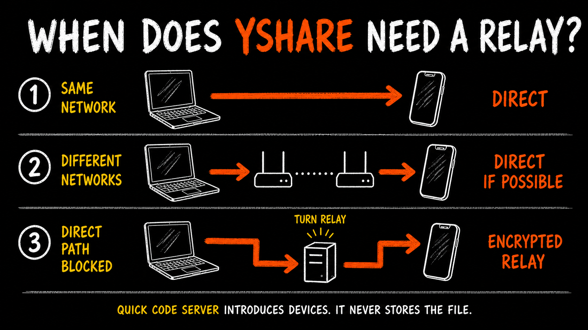
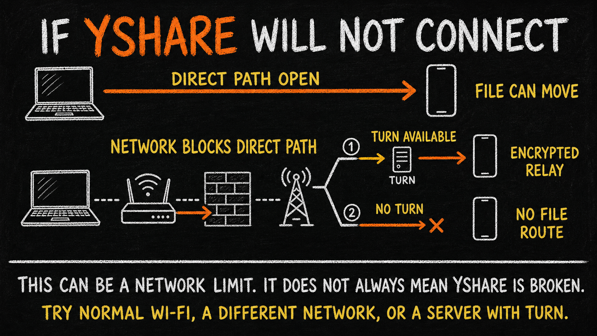
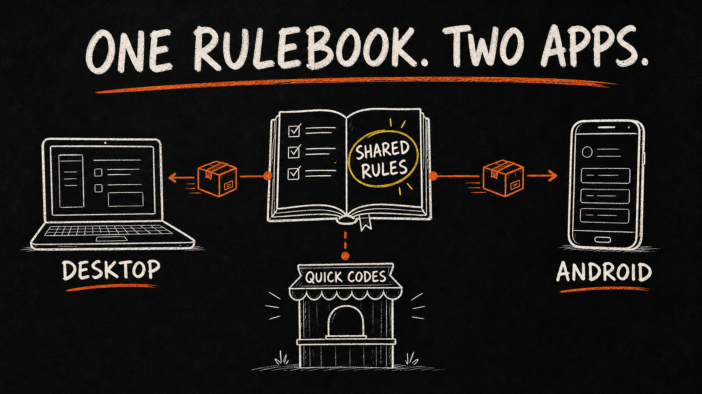

# YShare

Created by [Melt The Manual (@MeltTheManual)](https://github.com/MeltTheManual).

Send a file or folder directly from one device to another.

**No account. No cloud storage quota. No cloud copy left behind.**

YShare works on Windows and Android. Pick something, share a code, let the other person inspect the offer,
then send. The receiving device checks every byte before it says the transfer worked.

> **Current status:** the source code is public and pre-1.0. There is no official download yet. The Windows
> installer is unsigned, Android release signing is not finished, and unrelated-network relay testing is
> still required before downloadable builds are published.

## How it works



1. **Pick** one file or a whole folder.
2. **Share the code** with the person receiving it.
3. **They review the real offer** and choose Accept or Decline on their own device.
4. **YShare sends and verifies it.** Success appears only after the received bytes match.

Transfers work in either direction, computer to phone or phone to computer. You can also add a password.
The password itself is never sent.

## Where your file goes



YShare tries a direct WebRTC connection first. The file does not get uploaded to a storage service before
the other person can download it.

The short six-character code needs a small introduction service. That service only swaps temporary
connection information. It never stores the file.

Some network pairs cannot connect directly. In that case, a TURN relay can forward the encrypted traffic.
The relay carries bytes but still does not keep a cloud copy. Relay bandwidth costs money, so YShare ships
with no server address and no owner-funded service.



Adding your own server does not require changing YShare's code. Run the included service, paste its
`wss://` address into the **Quick connect server** setting on both devices, and save. Start with signaling
only. Add TURN later only if the networks you use cannot connect directly.

You have two ways to connect:

- **Quick Connect:** enter the address of a YShare server you run or trust, then use a six-character code.
- **Manual Connect:** copy and paste the longer connection codes. This needs no server at all.

Both devices must use the same Quick Connect server because that is the meeting point where they exchange
temporary connection information. For example, if the server is `wss://signal.example.com`, enter that exact
address on the computer and the phone. The address is a setting, not code that must be written into YShare.

## If YShare will not connect



A six-character code proves that the devices met through the same Quick Connect server. It does not prove
that the network will allow a path for the file. Manual Connect removes the need for the short-code server,
but it cannot force a blocked network to open a direct path.

- **Same normal Wi-Fi:** a direct transfer usually works without TURN.
- **Guest, hotel, school, or office Wi-Fi:** the network may isolate devices, even when both show the same
  Wi-Fi name.
- **Different networks:** YShare still tries a direct path, but a router, firewall, or mobile carrier may
  block it.
- **Direct path blocked and TURN available:** the encrypted transfer can use the relay.
- **Direct path blocked and no TURN available:** there is no file route. Try normal Wi-Fi, try another
  network, or use a Quick Connect server with TURN.

A failed connection does not automatically mean YShare's code is broken. The app now shows this same advice
when its connection attempt fails.

The self-hosting guide explains both signaling-only and relay setups: [run your own server](docs/SELF-HOSTING.md).

## What YShare protects

- The receiver must visibly accept every transfer.
- Names, paths, sizes, ranges, hashes, and transfer IDs from the other device are treated as untrusted.
- Files are checked with SHA-256 before success.
- Partial files are cleaned up after rejection, cancellation, or failure.
- Received folder paths are kept inside the chosen destination.

YShare does not scan files for malware or prove the real-world identity of the person using a code. Read the
plain-language [security boundary](SECURITY.md) before using it for sensitive transfers.

## Project structure



```text
src/                 Windows desktop app
mobile/              Android app
shared/engine.js     Connection, validation, transfer, and hashing rules shared by both apps
signaling/           Optional short-code introduction service and TURN credential service
tests/               Shared, desktop, signaling, and end-to-end checks
docs/                Self-hosting guide and README artwork
```

The desktop and Android apps are separate programs, but they use the same protocol engine. A change to a
connection code, file range, hash, or transfer message must work on both sides.

The file is split across eight WebRTC data channels. Each channel moves a different range. The receiver puts
those ranges back in the correct positions and verifies the finished file.

For the deeper technical design, read [ARCHITECTURE.md](ARCHITECTURE.md).

## Build it from source

You need Node.js 22.11 or newer. Android development also needs Java 17 and the Android SDK.

```bash
git clone https://github.com/MeltTheManual/YShare.git
cd YShare
npm ci
npm --prefix signaling ci
npm --prefix mobile ci
```

Run the Windows desktop app:

```bash
npm start
```

Build the unsigned Windows installer:

```bash
npm run dist
```

Android setup and signing instructions are in [mobile/README.md](mobile/README.md).

Run the full local verification gate:

```bash
npm run verify
```

## What is still unfinished

- There is no official installer or APK download yet.
- Unrelated-network transfers, including a path that really uses TURN, still need release-level proof.
- Interrupted transfers restart from zero.
- Publishing to Android Downloads requires Android 10 or newer.
- One sender, one receiver, and one file or folder can be active at a time.

This is an honest source release, not a claim that version 1.0 is finished.

## Contributing

Bug reports and focused pull requests are welcome. Please read [CONTRIBUTING.md](CONTRIBUTING.md) before
changing the transfer protocol or storage behavior.

Security problems should be reported privately through the process in [SECURITY.md](SECURITY.md).

## Licence

YShare is released under the [MIT License](LICENSE). Bundled font and library notices are in
[THIRD-PARTY-NOTICES.md](THIRD-PARTY-NOTICES.md).
