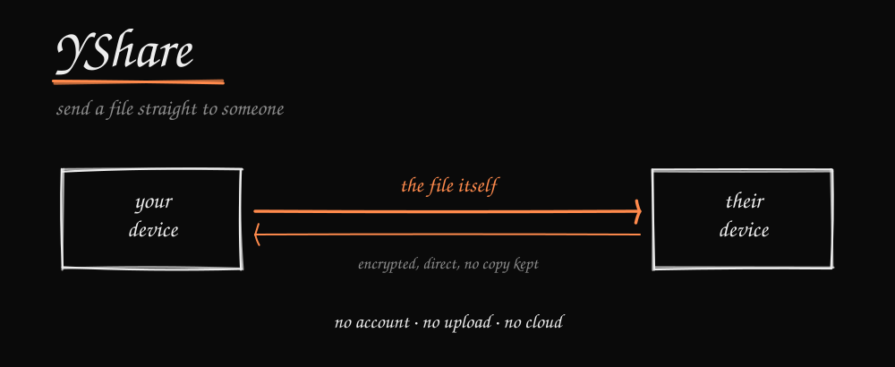
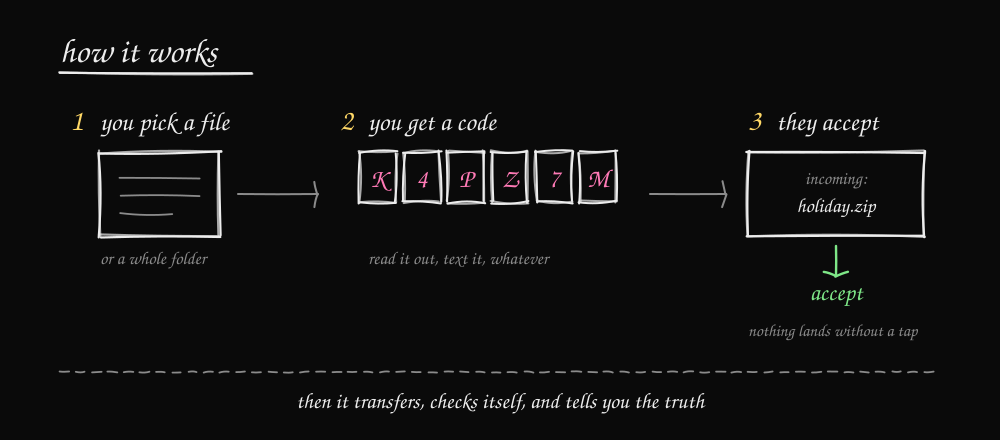
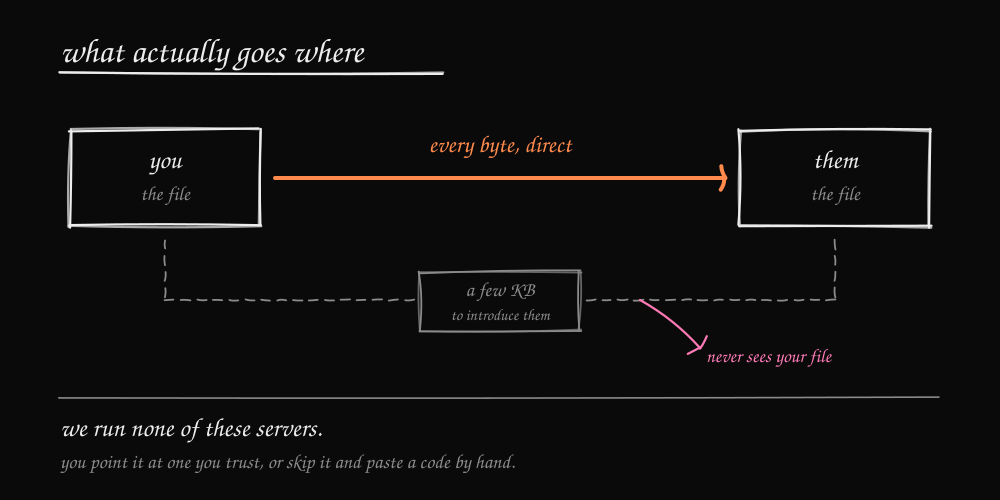
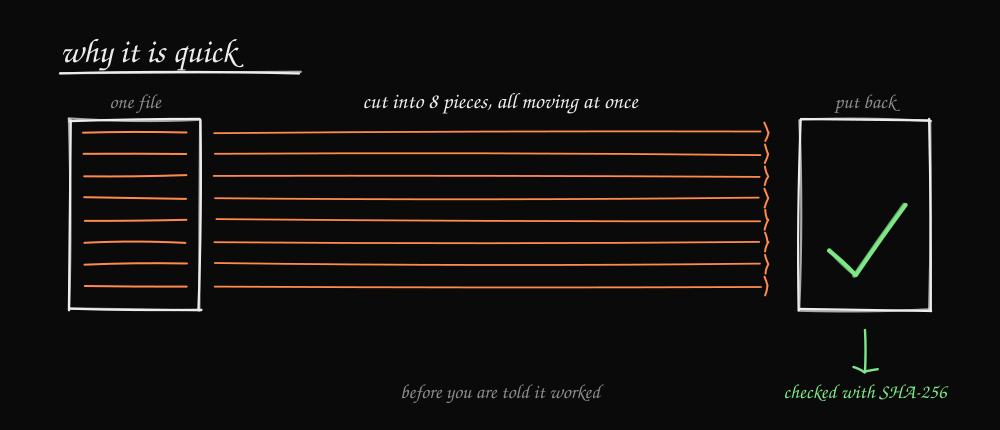

## Send a file straight to someone. No account. No upload. No cloud copy.

You pick a file. YShare gives you a six character code. You read that code to the other person. They type it in, see exactly what is being offered, and tap Accept. The file then travels directly between the two devices.

Nothing gets uploaded anywhere first. There is no copy sitting on a company's disk afterwards. When the transfer finishes, YShare checks the file byte for byte before it tells you it worked.

Windows and Android today. macOS, Linux and iOS later.

<br>



<br>

## Why this exists

Sending a big folder to someone usually means uploading it to a cloud service, waiting, sending a link, then hoping they download it before the link dies. Your file takes a round trip through a company's server to reach someone who might be sitting in the same room.

YShare cuts out the middle. There is no storage to fill up, no quota, no expiring link, and no second copy of your file living somewhere you forgot about.

## What it does

- Sends a **single file or a whole folder**, either direction, phone to computer or the other way.
- **Six character codes**, or longer manual codes when you have no server at all.
- **Direct connection first.** A relay is only used if the two networks refuse to talk.
- **The receiver has to say yes.** Nobody can push a file onto your device.
- **Optional password** on a transfer.
- Progress, speed, time remaining, and cancel from either side.
- **Checks the file with SHA-256** before calling it done.
- Half finished files are cleaned up when something goes wrong.
- Android keeps the transfer alive in the background with a notification.

<br>



<br>

## About that server

This is the part people ask about, so here it is plainly.

**YShare runs no servers.** There is no address built into the app. Nothing you send passes through us, and nobody ends up paying for somebody else's traffic.

The six character code does need a small "introduce these two devices" service somewhere. That service is in this repository, in `signaling/`. You can run it yourself in about five minutes, or point YShare at one you trust. The address goes in the app's own settings, on the home screen.

That service only passes a handshake of a few kilobytes. **Your files never go through it.**

Do not want to run anything at all? Use the manual codes instead. They need no server, and every safety rule stays exactly the same. It is a little more copying and pasting, that is the only difference.

Setting one up: [docs/SELF-HOSTING.md](docs/SELF-HOSTING.md)

<br>



<br>

## Where it is up to

This is pre 1.0 and built in the open, so here is the honest version.

Desktop `0.0.12` and Android `0.0.10` both work, in both directions, on real hardware. A file and a folder have gone across with matching hashes on both ends.

What is **not** finished:

- **There is nothing to download yet.** You build it from source today. The Windows installer is unsigned and the Android app still uses a development signing key, so neither belongs in a stranger's hands until that is sorted.
- **Transfers between different networks are not fully proven.** Same network and direct connections are tested. A full test across unrelated networks through a real relay is still to come.
- If a transfer breaks, it starts again from zero. There is no resume yet.
- Saving to Downloads on Android needs Android 10 or newer.
- One sender, one receiver, one thing at a time.

## Try it

You need Node.js 22.11 or newer. For the Android app you also need Java 17 and the Android SDK.

```bash
git clone https://github.com/MeltTheManual/YShare.git
cd YShare
npm ci
npm --prefix signaling ci
npm --prefix mobile ci
```

Run the desktop app:

```bash
npm start
```

Build the Windows installer:

```bash
npm run dist
```

The Android app needs a few more steps, so those live in [mobile/README.md](mobile/README.md).

Run everything the project checks before a change is allowed in:

```bash
npm run verify
```

## How it is built

Two apps, one rulebook.

```text
shared/engine.js     the rules both apps follow: codes, validation, ranges, hashing
src/                 desktop app (Electron). Main process owns the disk, renderer owns WebRTC
mobile/              Android app (React Native) plus its native file and background service code
signaling/           the small introduction service you can host yourself
tests/               shared and desktop regression tests
docs/                self hosting guide and the pictures on this page
```

The desktop app and the phone app are separate programs written in different languages. They share one file, `shared/engine.js`, which holds every rule about how a transfer works. That is why a file can go phone to computer without the two ends disagreeing about anything.

The file itself is split into eight pieces carried by eight parallel WebRTC data channels, which is what makes it quick. The receiving side writes each piece straight to its correct position on disk, then hashes the finished file before publishing it.

More detail is in [ARCHITECTURE.md](ARCHITECTURE.md).

## Safety

The short version:

- Everything the other side sends is treated as untrusted, and checked twice.
- What you accepted is what you get. The transfer is locked to the offer you agreed to.
- Success means written, hashed, verified and saved. Nothing else counts as success.
- File paths cannot escape the folder you chose.

The longer version, including a clear list of what YShare does **not** protect you from, is in [SECURITY.md](SECURITY.md). Found a security problem? That file explains how to report it privately.

## Contributing

Bug reports and pull requests are welcome. Please read [CONTRIBUTING.md](CONTRIBUTING.md) first, especially the safety rules near the top. They are not style preferences, they are the reasons this thing can be trusted with someone's files.

## Licence

MIT. See [LICENSE](LICENSE).

The bundled fonts (Instrument Serif, JetBrains Mono, Press Start 2P, and Architects Daughter in the drawings above) are under the SIL Open Font License, and pako is MIT and Zlib. Full texts are in [THIRD-PARTY-NOTICES.md](THIRD-PARTY-NOTICES.md).
